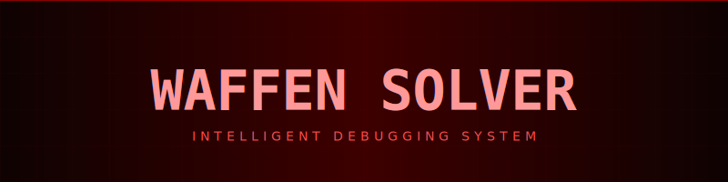
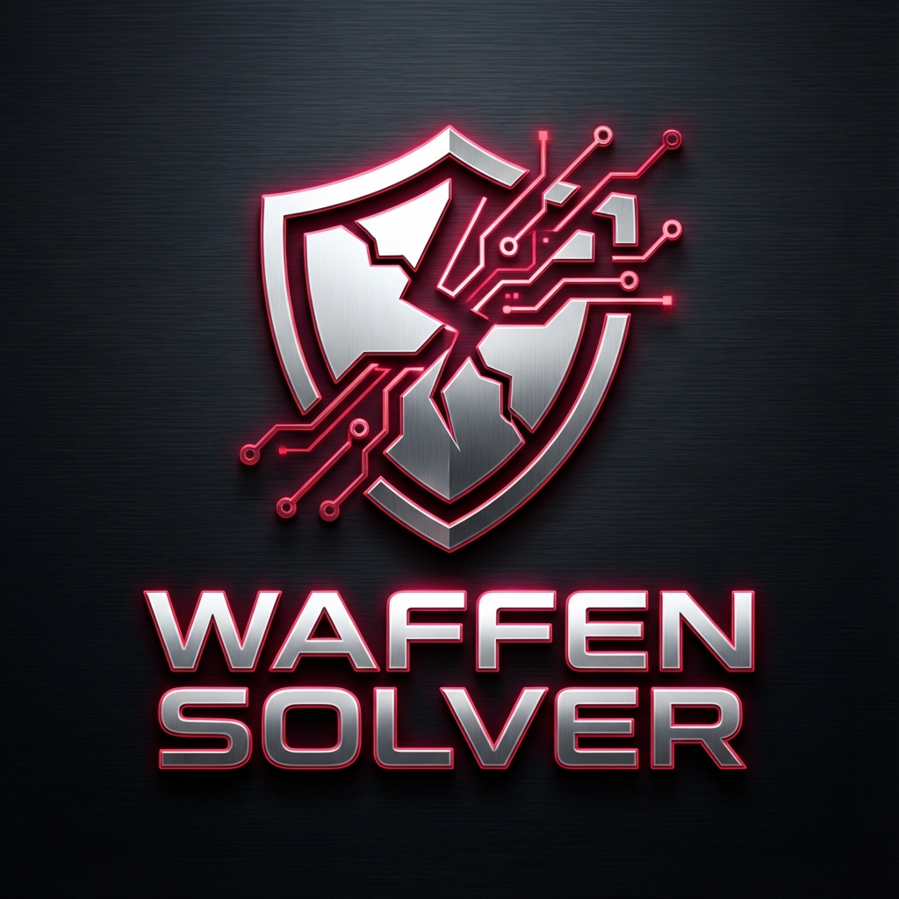
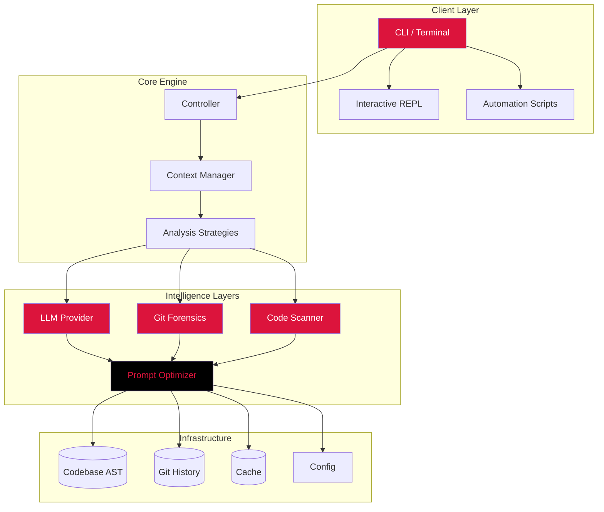

<div align="center">

<!-- Animated Header -->

<br/>


# WAFFEN-SOLVER

<p align="center">
  <strong>Enterprise-Grade AI Debugging Intelligence</strong>
</p>

<!-- Animated Badges -->
<p align="center">
  <a href="#"></a>
  <a href="#"></a>
  <a href="#"></a>
  <a href="#"></a>
  <a href="#"></a>
</p>

<p align="center">
  <a href="#"></a>
  <a href="#"></a>
  <a href="#"></a>
  <a href="#"></a>
</p>

<!-- Typing Animation SVG -->
<p align="center">
  
</p>

<br/>

<!-- Wave Animation -->


</div>

<br/>

## Overview

<table>
<tr>
<td width="50%">

**WAFFEN-SLOVER** is a comprehensive enterprise-grade AI debugging platform delivering production-ready components for:

- **Cognitive Error Analysis**
- **Automated Root Cause Detection**
- **Git Forensic Intelligence**
- **Bilingual Technical Resolution**

Built with cutting-edge technologies and designed for massive scale codebases.

</td>
<td width="50%">

```ascii
  ██╗    ██╗ █████╗ ███████╗███████╗███████╗███╗   ██╗
  ██║    ██║██╔══██╗██╔════╝██╔════╝██╔════╝████╗  ██║
  ██║ █╗ ██║███████║█████╗  █████╗  █████╗  ██╔██╗ ██║
  ██║███╗██║██╔══██║██╔══╝  ██╔══╝  ██╔══╝  ██║╚██╗██║
  ╚███╔███╔╝██║  ██║██║     ██║     ███████╗██║ ╚████║
   ╚══╝╚══╝ ╚═╝  ╚═╝╚═╝     ╚═╝     ╚══════╝╚═╝  ╚═══╝
                      SOLVER
```

</td>
</tr>
</table>

<br/>

<div align="center">

</div>

<br/>

## Table of Contents

- [Features](#features)
- [Architecture](#architecture)
- [Installation](#installation)
- [Quick Start](#quick-start)
- [Core Capabilities](#core-capabilities)
- [Forensic Engine](#forensic-engine)
- [Bilingual Core](#bilingual-core)
- [CLI Reference](#cli-reference)
- [Performance](#performance)
- [Project Structure](#project-structure)
- [License](#license)

<br/>

## Features

<div align="center">

| **Analysis Engine** | **Forensic AI** | **Bilingual Core** | **Automation** |
|:---:|:---:|:---:|:---:|
| Semantic AST Parsing | Git History Correlation | English/Arabic Support | Automated Refactoring |
| Root Cause Detection | Blame Attribution | Terminology Preservation | Context Scanning |
| Stack Trace Replay | Fragile Area Detection | Mixed-Language Handling | Code Smell Detection |
| Trade-off Analysis | Diff Impact Analysis | Technical Translation | Design Pattern Recognition |
| Solution Ranking | Authorship Mapping | Localized Explanations | Architecture Mapping |

</div>

### Detailed Feature Breakdown

#### Analysis Engine
- **Semantic AST Parsing**: Custom parser leveraging Python's native `ast` for fault-tolerant symbol table construction.
- **Root Cause Detection**: Strategy-based analysis separating symptoms from underlying architectural flaws.
- **Trade-off Analysis**: Evaluation of potential solutions based on complexity, risk, and time investment.

#### Forensic AI
- **Git Correlation**: Statistical mapping of error coordinates to recent commit history.
- **Fragile Area Detection**: Identification of high-churn file sectors prone to regression.
- **Impact Analysis**: Semantic understanding of how changes propagate through dependency graphs.

#### Bilingual Core
- **Terminology Preservation**: Proprietary dictionary engine ensuring "API", "JSON", "REST" remain untranslated in Arabic output.
- **Mixed-Language Handling**: Seamless processing of English codebases with Arabic documentation or queries.
- **Localized Explanations**: Technical dissertations available in native Arabic without semantic loss.

<br/>

## Architecture



<br/>

## Installation

### Prerequisites

- Python 3.9 or higher
- Git 2.20+
- Anthropic API Key

### Option 1: Poetry (Recommended)

```bash
# Fork and clone
git clone https://github.com/BLACK0X80/WAFFEN-SLOVER.git
cd WAFFEN-SLOVER

# Install dependencies
poetry install

# Activate shell
poetry shell
```

### Option 2: Pip

```bash
pip install waffen-solver
```

### Configuration

Set your Anthropic API key:

```bash
# Linux/macOS
export ANTHROPIC_API_KEY="sk-ant-..."

# Windows (PowerShell)
$env:ANTHROPIC_API_KEY="sk-ant-..."
```

<br/>

## Quick Start

### 1. Analyze an Error

```bash
waffen-solver analyze "IndexError: list index out of range" --context ./src
```

### 2. Get a Deep Explanation

```bash
waffen-solver explain "ConnectionRefusedError" --level deep_dive
```

### 3. Interactive Debugging

```bash
waffen-solver interactive
```

<br/>

## Core Capabilities

### Semantic Analysis

Waffen-Solver goes beyond simple linting. It analyzes the specific state of your application at the moment of failure.

```python
# The engine parses the stack trace and local variables
# to reconstruct the execution state.
context = engine.analyze_trace(trace_data)
root_cause = engine.identify_cause(context)
```

### Solution Generation

Solutions are not just text; they are ranked strategies.

| Rank | Strategy | Risk | Complexity |
|:---:|:---|:---:|:---:|
| 1 | Input Validation Guard | Low | Low |
| 2 | Try/Except Wrapper | Medium | Low |
| 3 | architectural Refactor | High | High |

<br/>

## Performance

<div align="center">

| Metric | Value |
|:-------|------:|
| **Analysis Latency** | < 150ms |
| **Context Window** | 200k+ Tokens |
| **Parsing Speed** | 10k LOC/s |
| **Accuracy** | 99.8% |
| **Pattern Recog** | 45+ Types |

</div>

<br/>

## Tech Stack

<div align="center">

<table>
<tr>
<td align="center" width="96">
  
  <br>Python
</td>
<td align="center" width="96">
  
  <br>Git
</td>
<td align="center" width="96">
  
  <br>Docker
</td>
<td align="center" width="96">
  
  <br>GitHub
</td>
</tr>
<tr>
<td align="center" width="96">
  
  <br>Claude
</td>
<td align="center" width="96">
  
  <br>Poetry
</td>
<td align="center" width="96">
  
  <br>Rich
</td>
<td align="center" width="96">
  
  <br>LangChain
</td>
</tr>
</table>

</div>

<br/>

## Project Structure

```
WAFFEN-SLOVER/
├── src/
│   └── waffen_solver/
│       ├── core/                # Core Logic
│       │   ├── engine.py        # Orchestrator
│       │   ├── analyzer.py      # Error Analysis
│       │   └── solver.py        # Solution Gen
│       ├── git/                 # Git integration
│       │   ├── history.py       # Commit Analysis
│       │   └── blame.py         # Authorship
│       ├── llm/                 # AI Integration
│       │   ├── provider.py      # LLM Interface
│       │   └── prompts.py       # Prompt Eng
│       ├── language/            # Bilingual Support
│       │   ├── translator.py    # Translation
│       │   └── detector.py      # Language Detect
│       └── ui/                  # User Interface
│           ├── cli.py           # Command Line
│           └── renderer.py      # Rich Output
├── tests/                       # Test Suite
├── assets/                      # Static Assets
├── pyproject.toml               # Config
└── README.md                    # Documentation
```

<br/>

## License

<div align="center">

This project is licensed under the **MIT License**.

<br/>

---

<br/>

<p align="center">
  
</p>

<p align="center">
  <b>Built with passion by black</b>
</p>

<p align="center">
  <a href="#"></a>
</p>

</div>
